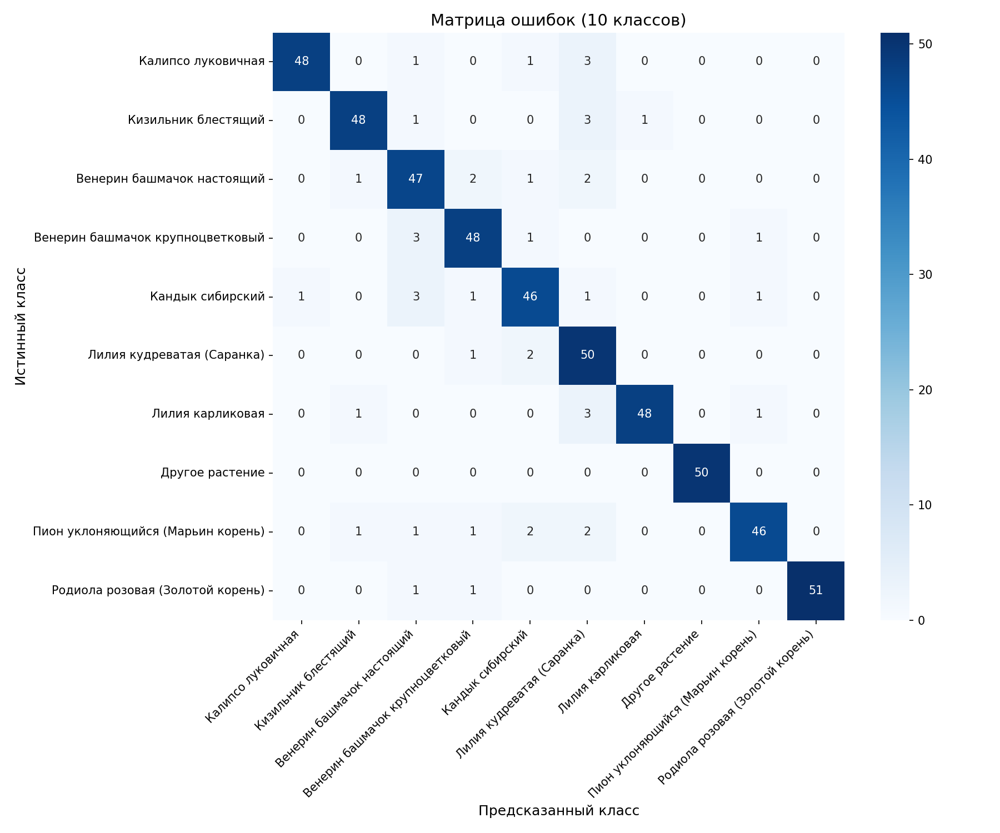
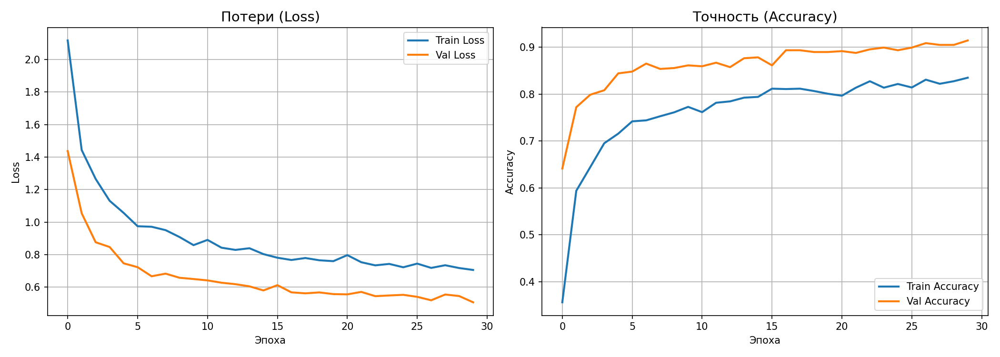

# 🌿 Rare Plants Classifier - Иркутская область

**ИИ-определитель редких и охраняемых растений Иркутской области**

## Содержание

- [Описание](#описание)
- [Цель проекта](#цель-проекта)
- [Какие растения определяет модель](#какие-растения-определяет-модель)
- [Информация о модели](#информация-о-модели)
- [Результаты](#результаты)
- [О проекте](#о-проекте)

---

## Описание

Разработка системы компьютерного зрения для автоматической идентификации **редких видов растений Иркутской области** (Красная книга РФ) по фотографиям.

**Проблема:** В Иркутской области более 200 видов растений занесены в Красную книгу. Туристы и местные жители часто не могут отличить редкие растения от обычных и случайно их повреждают.

**Решение:** Нейросетевая модель, которая по фотографии определяет:
- Является ли растение редким (или это обычное растение - класс "Other")
- К какому из редких видов относится растение (на данный момент 9)

---

## Цель проекта

Разработать и обучить свёрточную нейросеть для классификации редких видов растений Иркутской области (на данный момент 9) с возможностью отличать их от обычных растений.

### Задачи

1. Собрать датасет изображений с сайта Plantarium.ru
2. Провести аугментацию данных для балансировки классов
3. Реализовать Transfer Learning на архитектуре MobileNetV2
4. Оценить качество модели на тестовой выборке

---

## Какие растения определяет модель

### 9 редких видов Иркутской области

| № | Русское название | Латинское название |
|---|-----------------|-------------------|
| 1 | Кандык сибирский | *Erythronium sibiricum* |
| 2 | Венерин башмачок крупноцветковый | *Cypripedium macranthos* |
| 3 | Венерин башмачок настоящий | *Cypripedium calceolus* |
| 4 | Родиола розовая (Золотой корень) | *Rhodiola rosea* |
| 5 | Пион уклоняющийся (Марьин корень) | *Paeonia anomala* |
| 6 | Кизильник блестящий | *Cotoneaster lucidus* |
| 7 | Лилия кудреватая (Саранка) | *Lilium martagon* |
| 8 | Лилия карликовая | *Lilium pumilum* |
| 9 | Калипсо луковичная | *Calypso bulbosa* |

### Класс "Other"

Обычные растения, НЕ входящие в Красную книгу:
- Берёза повислая, Сосна обыкновенная, Одуванчик лекарственный
- Клевер луговой, Крапива двудомная, Подорожник большой
- Ромашка аптечная, Лютик ползучий, и другие

---

## Информация о модели

### Архитектура модели

| Параметр | Значение |
|----------|----------|
| **Базовая модель** | MobileNetV2 (предобучена на ImageNet) |
| **Входной размер** | 224×224×3 |
| **Классов** | 10 (9 редких видов + "Other") |
| **Trainable параметры** | 165,258 (645.54 KB) |
| **Всего параметров** | 2,423,242 (9.24 MB) |

### Структура сети

| # | Layer | Output Shape | Param # |
|---|-------|--------------|---------|
| 1 | MobileNetV2 (Functional) | (None, 7, 7, 1280) | 2,257,984 |
| 2 | GlobalAveragePooling2D | (None, 1280) | 0 |
| 3 | Dropout (rate=0.4) | (None, 1280) | 0 |
| 4 | Dense (ReLU + L2) | (None, 128) | 163,968 |
| 5 | Dropout (rate=0.3) | (None, 128) | 0 |
| 6 | Dense (Softmax) | (None, 10) | 1,290 |

### Гиперпараметры обучения

| Параметр | Значение |
|----------|----------|
| **Оптимизатор** | Adam (lr=0.001) |
| **Функция потерь** | Categorical Crossentropy |
| **Batch size** | 32 |
| **Эпохи** | 30 (с ранней остановкой) |
| **Dropout** | 0.4, 0.3 |
| **L2 регуляризация** | 0.001 |

---

## Результаты

### Метрики качества

| Метрика | Значение |
|---------|----------|
| **Точность на валидации** | 91.46% |
| **Точность на тесте** | 91.46% |

### Точность по классам

| Класс | Precision | Recall | F1-score |
|-------|-----------|--------|----------|
| Калипсо луковичная | 98% | 91% | 94% |
| Кизильник блестящий | 94% | 91% | 92% |
| Венерин башмачок настоящий | 82% | 89% | 85% |
| Венерин башмачок крупноцветковый | 89% | 91% | 90% |
| Кандык сибирский | 87% | 87% | 87% |
| Лилия кудреватая (Саранка) | 78% | 94% | 85% |
| Лилия карликовая | 98% | 91% | 94% |
| **Другое растение** | **100%** | **100%** | **100%** |
| Пион уклоняющийся | 94% | 87% | 90% |
| Родиола розовая | **100%** | 96% | 98% |

### Матрица ошибок

### Графики обучения

---

## О проекте

### Лицензия

Код проекта: MIT License

Датасет: Plantarium.ru (CC BY-NC)

### Контакты

Автор: Дылгыров Булат

GitHub: [Bulat844](https://github.com/Bulat844)

---

🌟 Если проект оказался полезным, поставьте звезду! 🌟

